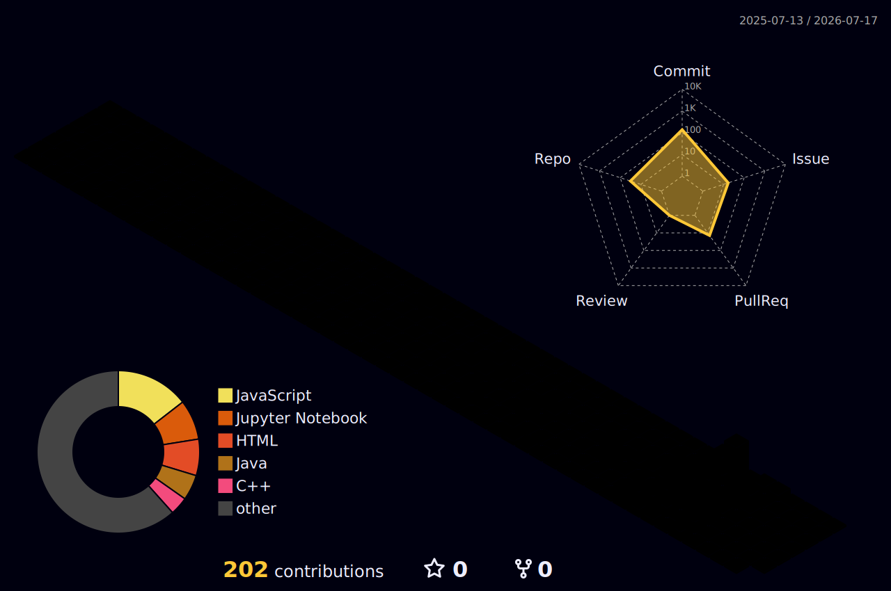

<div align="center">

<h1 align="center">
  
</h1>

<h3 align="center" style="color:#94A3B8;">
  B.Tech C (AI) @ KIET &nbsp;|&nbsp; AWS Certified ML & Data Engineer &nbsp;|&nbsp; Open Source
</h3>

<br/>

> *"The best way to predict the future is to build it with data."*

<br/>


&nbsp;
[](https://github.com/Deepakchwdhry)

<br/>

[](https://www.linkedin.com/in/deepak-chaudhary-000998327/)
[](https://github.com/Deepakchwdhry)
[](mailto:deepak.2428cseai2445@kiet.edu)

</div>

---

## 🙋‍♂️ About Me

- 🎓 **3rd-year B.Tech CSE (AI)** @ KIET Group of Institutions, Muradnagar, UP — CGPA: **8.11**
- 🏅 **3× AWS Certified** — ML Associate · Data Engineer Associate · Cloud Practitioner
- 🤝 **Open Source Contributor** — GirlScript Summer of Code **(GSSoC 2026)** · Active
- 🏆 **Hackathon Runner-Up** — HackTrepreneur @ KIET Endeavour'26 *(Team FlatKeLadke)*
- 🌱 Currently exploring **Deep Learning** (CNN · RNN · LSTM · GRU) & **AWS Data Pipelines**
- 💬 Ask me about **ML pipelines, MERN stack, or AWS cloud**
- 📫 Reach me: **deepak.2428cseai2445@kiet.edu**
- 🚀 **Open to internships** in ML · Data Engineering · SDE

---

## 🔧 Currently Working On

```
🤝  GSSoC 2026         ██████████████████░░   [Active]    Open source contributions — AI/ML & Web repos
🌱  Deep Learning      █████████████░░░░░░░   [Learning]  CNN, RNN, LSTM, GRU with TensorFlow & PyTorch
📊  AWS Data Eng       ████████████░░░░░░░░   [Certified] Building data pipelines with Glue & Athena
🛕  DarshanEase        ████████████████████   [Deployed]  MERN temple booking platform — live on Render
```

---
<div align="center">

[](https://git.io/typing-svg)

</div>

---

## 🛠️ Tech Stack & Proficiency

**Programming Languages**


**ML & AI**


**Frontend & Backend**


**Database & Cloud**


**Data & Visualization**


---

## 🚀 Featured Projects

| Project | Description | Tech Stack |
|---|---|---|
| 🛕 **[DarshanEase](https://github.com/Deepakchwdhry)** | MERN temple booking platform · real-time slots · ~40% fewer conflicts · JWT 3-tier auth · sub-300ms response | React (Vite) · Express · MongoDB · JWT · Render |
| 🔍 **[Fraud Detection Model](https://github.com/Deepakchwdhry)** | Random Forest on 284K+ transactions · SMOTE boosted recall 62%→91% · ROC-AUC 0.97 | Python · Scikit-learn · SMOTE · Pandas |
| 📚 **[Library Management System](https://github.com/Deepakchwdhry)** | 500+ book records · CRUD · search/filter engine reducing discovery time ~60% | JavaScript · REST API · HTML/CSS |
| 📈 **[Trading Bot](https://github.com/Deepakchwdhry)** | AI-powered bot · ML-based signal detection · automated buy/sell decisions | Python · ML · Financial APIs |

---

## 🏅 Certifications

| Certification | Issuer | Year |
|---|---|---|
| 🥇 AWS Certified Data Engineer – Associate | Amazon Web Services | 2026 |
| 🥇 AWS Certified Machine Learning – Associate | Amazon Web Services | 2026 |
| ☁️ AWS Certified Cloud Practitioner | Amazon Web Services | 2025 |
| 📚 AWS Academy Graduate – ML Foundations | Amazon Web Services | 2025 |
| 🎓 Foundation Level Certificate – Data Science | IIT Madras | 2025 |
| 🤖 Artificial Intelligence Primer | Infosys Springboard | 2025 |

---

## 🏆 Highlights

| Achievement | Details |
|---|---|
| 🥈 HackTrepreneur Runner-Up | KIET Endeavour'26 · Annual Entrepreneurship Summit · Team FlatKeLadke |
| 🤝 GSSoC 2026 | Active open-source contributor — AI/ML & Web projects |
| 🏅 Sports Captain | 1st in Kabaddi & Cricket (District Level) · 2nd in Kho-Kho |
| 🌐 Languages | English · Hindi · French · Pearson MePro Advanced Certified |

---

## 📊 GitHub Stats

<div align="center">
<br/><br/>


<br/><br/>
</div>

---

## 🌐 3D Contribution Calendar

<div align="center">



</div>

---

<div align="center">

### 🤝 Connect with me

[](https://www.linkedin.com/in/deepak-chaudhary-000998327/)
[](mailto:deepak.2428cseai2445@kiet.edu)
[](https://github.com/Deepakchwdhry)

<br/>

*⭐ Star my repos if you find them useful!*

</div>
